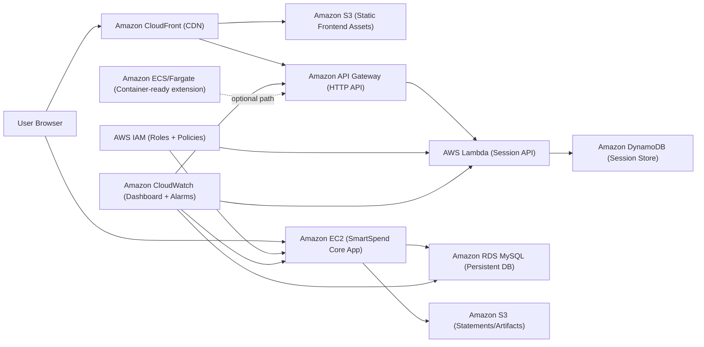

# SmartSpend AWS CA-2: Flowchart + Methodology

## Architecture Flowchart (Mermaid)

## Methodology (Step-by-Step)

1. Set up Terraform providers and reusable variables.
2. Provision base networking in AWS VPC with public subnets, route table, and internet gateway.
3. Deploy EC2 instance and bootstrap runtime for SmartSpend.
4. Attach IAM role and instance profile for secure AWS service access.
5. Add S3 bucket(s) for assets and application files.
6. Provision RDS MySQL for managed persistent storage.
7. Configure CloudWatch dashboard and alarms for observability.
8. Implement serverless layer with Lambda + API Gateway + DynamoDB.
9. Add CloudFront to deliver frontend/API globally with lower latency.
10. Validate all public endpoints and capture screenshots for CA report.

## Final Methodology For Report (With Evaluation Proof)

1. Infrastructure as Code was implemented using Terraform from `D:\newwork\finset\infra\aws`, ensuring reproducible deployment.
2. Core AWS services were provisioned: EC2 (compute), S3 (storage), IAM (security), VPC (network), and RDS (database).
3. Advanced AWS services were integrated: CloudFront (CDN), CloudWatch (monitoring), Lambda + API Gateway (serverless API), and Auto Scaling + ALB (dynamic scalability).
4. Public access and service verification were validated through live URLs and health endpoints after apply.
5. Scalability was implemented and evaluated using ALB + ASG with CPU target tracking policy.
6. Monitoring and reliability evidence was collected through CloudWatch dashboards, alarms, target health checks, and Terraform outputs.
7. All outcomes were mapped to rubric criteria: scalability, availability, security, performance, and monitoring/cost management.

## Evaluation With Proof (Rubric-Aligned)

### Scalability (0-15)
- Proof 1: Auto Scaling Group `smartspend-asg` with min=1, desired=1, max=2.
- Proof 2: Target tracking policy `ASGAverageCPUUtilization` at 60%.
- Proof 3: ALB URL returns `200 OK`: `http://smartspend-alb-1659122344.ap-south-1.elb.amazonaws.com`.
- Screenshots: ASG details page, scaling policy page, ALB listener + target group health.

### Availability (0-15)
- Proof 1: ALB health checks on `/health` route.
- Proof 2: Multi-subnet setup (`public_a`, `public_b`) used across ALB and ASG.
- Proof 3: Managed services (RDS, API Gateway, Lambda, CloudFront) reduce single points of failure.
- Screenshots: target group healthy targets, subnet/route map, RDS status “available”.

### Security Measures (0-10)
- Proof 1: IAM roles and instance profile attached for controlled AWS access.
- Proof 2: Security groups restrict inbound traffic by service role.
- Proof 3: S3 public access protections active (except intentionally controlled paths).
- Screenshots: IAM role/policies, EC2 security group inbound rules, S3 block public access settings.

### Performance (0-10)
- Proof 1: CloudFront public distribution active for low-latency delivery.
- Proof 2: API health endpoint active through API Gateway + Lambda.
- Proof 3: ALB distributes traffic to healthy backend targets.
- Screenshots: CloudFront distribution deployed status, API invoke health response, ALB metrics panel.

### Monitoring & Cost Management (0-10)
- Proof 1: CloudWatch dashboard `smartspend-ops-dashboard`.
- Proof 2: Alarms: `smartspend-high-cpu`, `smartspend-status-check-failed`.
- Proof 3: Free-tier conscious sizing (`t3.micro`, `db.t3.micro`, ASG max=2).
- Screenshots: CloudWatch dashboard widgets, alarm states, Terraform variables showing cost-safe limits.

## Terraform Evidence Block (Use in Report Appendix)

- Command used: `terraform output`
- Evidence file: `D:\newwork\finset\infra\aws\terraform-proof.txt`
- Timestamp captured in file header.

### Key Public URLs (Evidence)

- EC2 app: `http://13.126.236.250`
- CloudFront app: `https://d32mdmgo38tqfw.cloudfront.net`
- API health: `https://axgzeflfqa.execute-api.ap-south-1.amazonaws.com/health`
- ALB scalability URL: `http://smartspend-alb-1659122344.ap-south-1.elb.amazonaws.com`

## Verification URLs

- EC2 frontend: `http://13.126.236.250`
- CloudFront frontend: `https://d32mdmgo38tqfw.cloudfront.net`
- API Gateway Lambda health: `https://axgzeflfqa.execute-api.ap-south-1.amazonaws.com/health`

## Screenshot Checklist

1. VPC page showing VPC and subnets.
2. Route table + internet gateway attachment.
3. Security group inbound rules.
4. EC2 instance running state + public IP.
5. IAM role and attached policies.
6. S3 bucket list and properties.
7. RDS instance details (endpoint + class).
8. Lambda function overview.
9. API Gateway routes and invoke URL.
10. CloudFront distribution status and domain.
11. CloudWatch dashboard widgets.
12. CloudWatch alarms list.
13. Browser screenshot of live frontend URL.
14. Browser/API tool screenshot of `/health` response.
